<!--HEADINGS-->
# Implementación del Certificado gratuito cloudflare TLS/SSL en GoDaddy, opción 1
El certificado SSL ayuda a los lectores a tener confianza en la pagina web visitada además los navegadores actuales bloquean la pagina que no tenga dicho certificado, por lo tanto es importante tener uno.

Como podemos ver al escribir en la url la dirección de la pagina web nos indica que no es segura y tenemos que realizar pasos extra para poder acceder a ver el contenido.

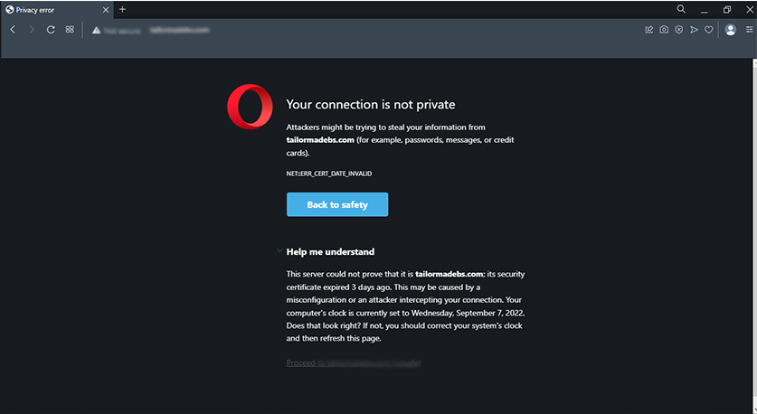

Click en proceed para continuar

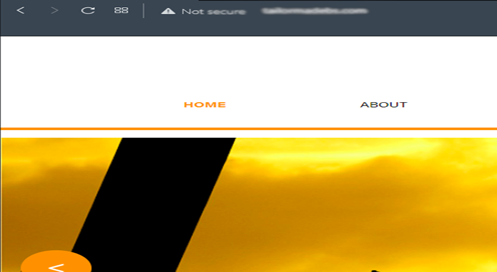
Algunas de las paginas web que administro les instalaba manualmente cada 90 días un certificado SSL  [**ZeroSSL.com**](https://zerossl.com/ "certificados SSL gratis")  pero ya muestra el siguiente mensaje:

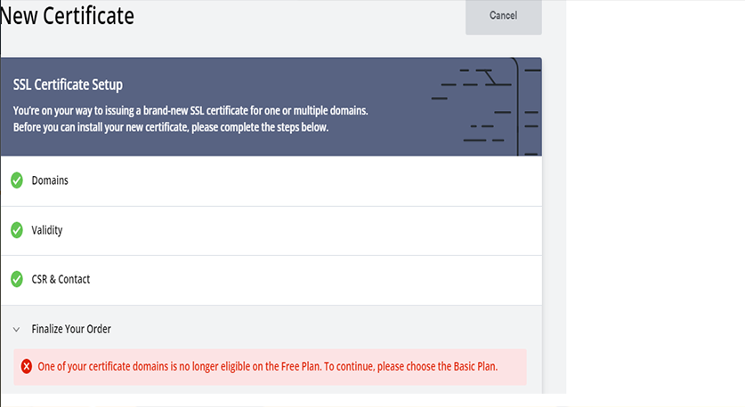

Buscando variantes encontré algunas opciones y la más practica es utilizar Let's Encrypt con certbot sin embargo el hosting no permite utilizarlo para implementar los certificados 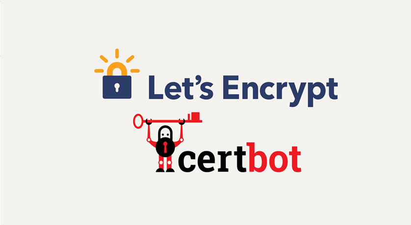

Por lo tanto vamos a utilizar la opción     [**cloudflare**](https://www.cloudflare.com/es-es/what-is-cloudflare/)

Por lo cual vamos a ingresar a su pagina web y creamos una cuenta
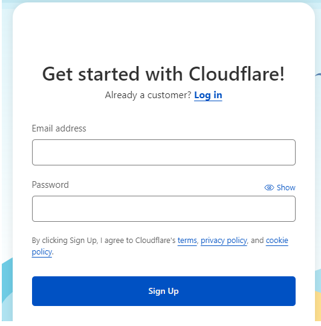
Luego vamos a escoger la opción proteger tu presencia en internet, click en empezar 
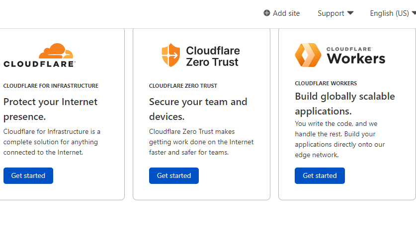 
Aquí tenemos que escribir el dominio y click en agregar sitio
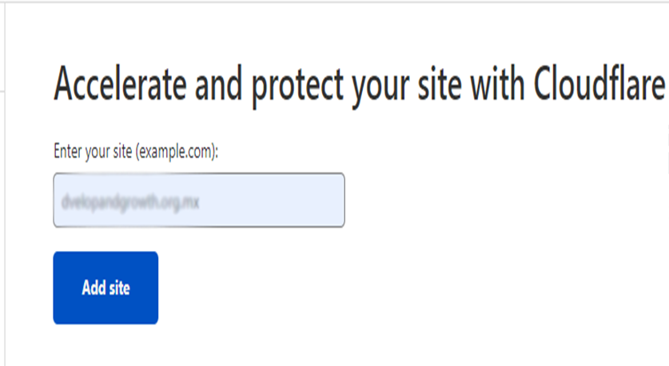
A continuación seleccionamos la opción gratuita y 
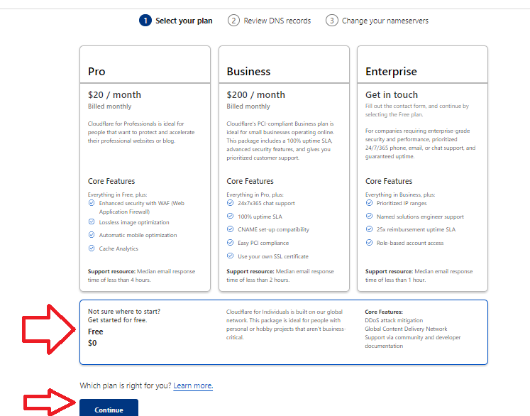
Volvemos a seleccionar continuar
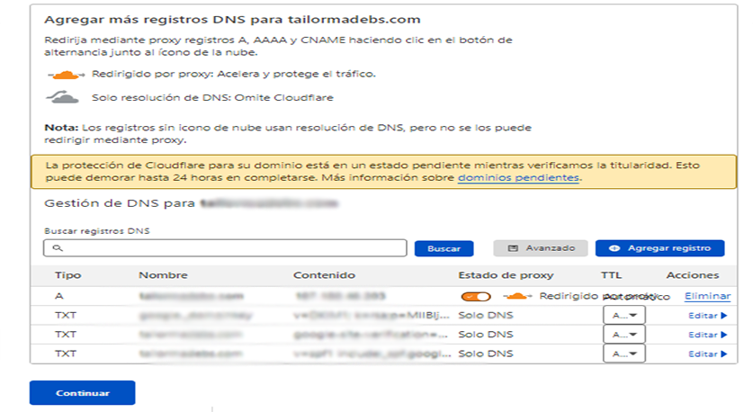
Ahora tendremos que hacer el cambio de los DNS de tu hosting por los de cloudflare 
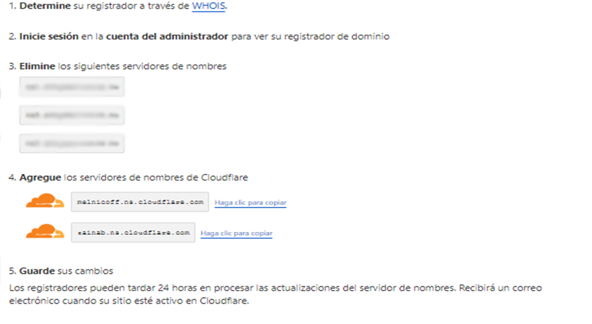
Accedemos ahora a nuestro admnistrador de DNS (hosting y remplazamos los que tenemos por default que nos proporciona nuestro hosting y lo sustiuimos por los que nos indica cloudflare
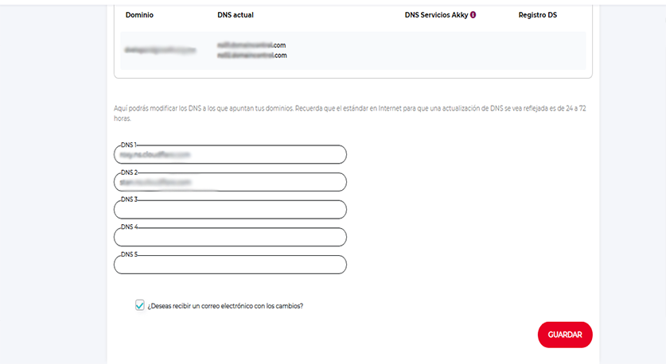
Regresamos a la pagina de cloudflre y presiomos el botón Listo, Revisar los servidores de nombre y al finalizar nos aparecerá las siguientes ipciones
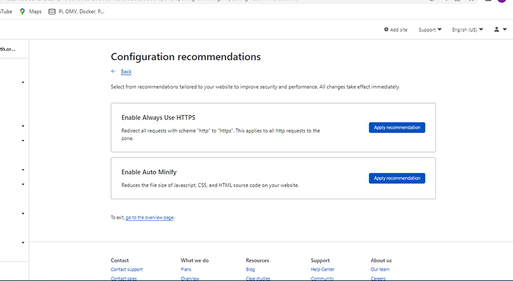 
El cuál tenemos que activar el servicio HTTPS, la otra opción es a consideración de cada quién, click en ver el resumen.
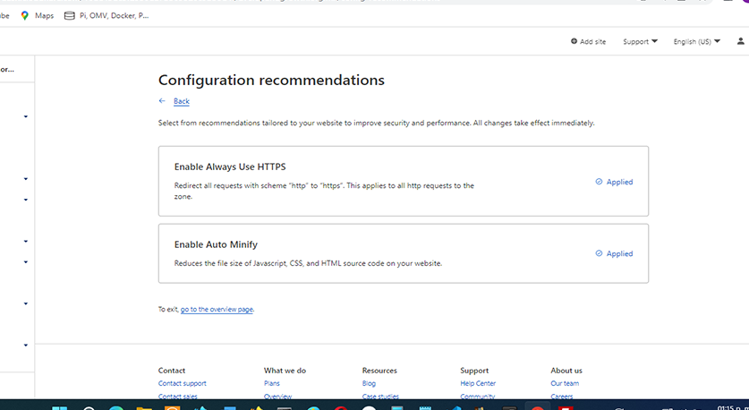
Aquí tenemos que habilitar SSL/TSL
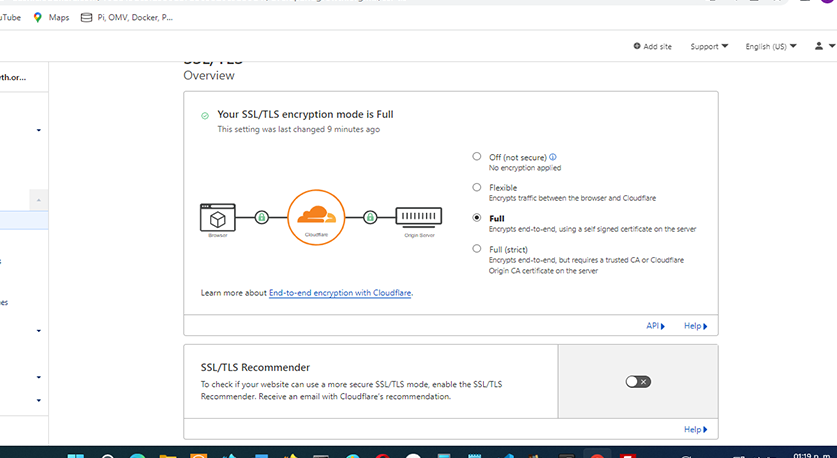
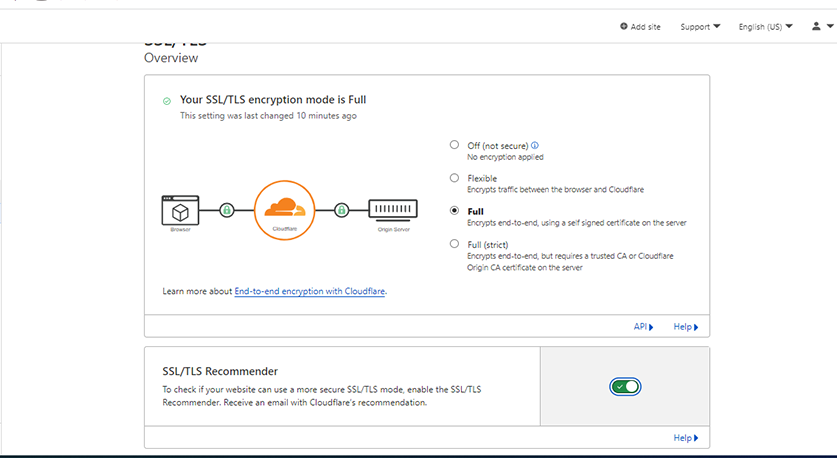
Ahora nos queda esperar unos minutos u horas esto debido a que el DNS termine de notificar a toda la red el cambio. 
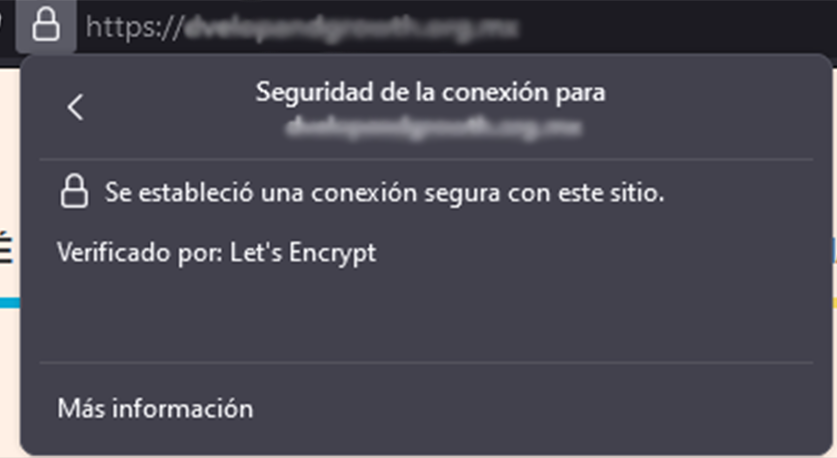
